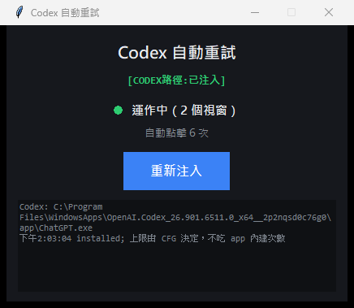

# codex-never-give-up

> **EN:** Unofficial auto-retry for the **OpenAI Codex desktop app** on Windows.
> When a turn dies with `serverOverloaded` ("Selected model is at capacity"), the app
> waits 10s → 30s → 120s → 300s, gives up, and leaves a **Retry** button for you to click.
> This tool retries immediately and indefinitely — for the conversation you are looking at
> *and* for background conversations, where the app itself cannot retry at all.
> Detection happens on the app-server IPC stream, not by scraping the UI.
> Not affiliated with OpenAI. See [Disclaimer](#免責).



---

## 它解決什麼

Codex 桌面版遇到上游過載時，行為是寫死的：

```
第 1 次過載 → 等 10 秒 → 重試
第 2 次     → 等 30 秒
第 3 次     → 等 120 秒
第 4 次     → 等 300 秒
第 5 次     → 放棄，丟一顆「重試」按鈕給你手點
```

renderer bundle 裡就是這張表：`LDr = [10, 30, 120, 300]`。而真正讓它「停下來」的不是秒數，
是取值函式 `return LDr[r] ?? null` —— 一旦連續次數超過表長就回 `null`，倒數元件不再渲染，
整條自動重試路徑消失。

更麻煩的是**背景對話**：那個倒數計時器活在 React 元件裡，元件沒掛載就不會跑。
所以你沒在看的對話一旦過載，**原版 Codex 永遠不會自己重試**，會一直卡到你切過去。

這個工具做三件事：

| 層 | 做什麼 |
|---|---|
| 偵測 | 監聽 app-server 的 IPC 事件流，用 `codexErrorInfo` + `willRetry:false` 判斷 |
| 當前對話 | 立刻觸發 app 自己的重試按鈕（走官方路徑，最保險） |
| 背景對話 | 直接送 `turn/start` RPC，不碰 DOM、不切畫面、不影響顯示 |

上限與間隔由設定檔決定，不再吃 app 內建的 4 / 5 / 10 次。

---

## 安裝與使用

### 圖形介面（推薦）

Windows 若沒把 `.pyw` 關聯到 Python，雙擊腳本不會啟動。請雙擊 `run.bat`，或：

```
pythonw codex_retry_gui.pyw
```

按「一鍵注入」。它會關掉 Codex、以 Store 套件啟動方式帶 `--remote-debugging-port` 重開、注入所有視窗，
之後新開的視窗自動補上。全程沒有主控台黑框。

找不到 Codex 安裝路徑時按鈕是灰的，不會亂跑。

> 不能直接 `CreateProcess` `WindowsApps\...\ChatGPT.exe`（會 WinError 5 存取被拒，畫面卡在「啟動 Codex」）。
> 必須走 `IApplicationActivationManager`，參數才會進 Chromium。

### 命令列

```
python codex-inject.py --force --watch
```

`--force` 允許關閉正在跑的 Codex（Chromium 只在啟動時吃 debug port，沒有別的辦法）。
`--watch` 持續盯新開的視窗。

### 打包成單一 exe

```
pip install pyinstaller
pyinstaller --onefile --noconsole --name "codex-never-give-up" --icon icon.ico ^
            --add-data "codex-retry-hook.js;." codex_retry_gui.pyw
```

> Codex 每次重開都要重新注入一次 —— 這是「不修改 app 檔案」換來的代價，
> 好處是 Codex 更新不會把它蓋掉。

### 需求

- Windows，Codex 桌面版（MSIX，`OpenAI.Codex`）
- Python 3.10+，`pip install aiohttp`
- Node.js（只有跑測試需要）

---

## 運作細節

### 偵測訊號

app-server 的通知全部走 renderer 的 `window` `message` 事件，每則都帶 `threadId`：

```json
{"type":"mcp-notification","hostId":"local","method":"error","params":{
  "error":{"message":"Selected model is at capacity. Please try a different model.",
           "codexErrorInfo":"serverOverloaded"},
  "willRetry":false,
  "threadId":"…","turnId":"…"}}
```

`willRetry` 是關鍵：為 `true` 時工具完全不插手，讓 app-server 自己跑完，
不會兩邊搶著重試。只有 `false`（app-server 明說放棄）才接手。

這條通道與 UI 是否掛載無關，所以背景對話一樣偵測得到。

### 背景重送

送出方向的信封（實際錄下來的，不是猜的）：

```js
{ type: 'mcp-request', hostId: 'local', priority: 'critical', source: 'turn',
  retainResponse: true, timeoutMs: 30000, expiresAtMs: <now+30s>,
  request: { id: <uuid>, method: 'turn/start', params: {
    threadId, turnTrigger: 'capacity_retry_manual',
    clientUserMessageId: <uuid>, input: [],
    approvalPolicy: null, approvalsReviewer: null, sandboxPolicy: null,
    permissions: null, model: null, effort: null, outputSchema: null,
    cwd, runtimeWorkspaceRoots, collaborationMode,
    responsesapiClientMetadata, multiAgentMode, summary, personality, serviceTier
  }}}
```

兩件事讓這個做法安全：

1. **`input` 是空陣列。** 重試不重送你的訊息內容 —— app-server 自己有 thread 狀態。
   所以不需要重建任何 prompt。
2. **所有 policy 欄位送 `null`。** 這是 app 自己重試時的實際行為，由 server 從 thread
   既有狀態去解。工具照抄，不會把 `permissions: ":danger-full-access"` 這類東西帶出去。

per-thread 的 `cwd` / `collaborationMode` 等欄位，是從**該 thread 自己送過的
`turn/start` 原封快取**下來的，不是編的。快取存在 `localStorage`
（30 天 TTL、上限 50 筆），所以重開 app 或重載頁面都不會丟。

> 某個 thread 從未被錄到 `turn/start` 時就沒有模板，工具會記錄後停手，不會瞎送。
> 在那個對話送任何一則訊息即可建立模板。

### 分類靠 i18n key，不靠按鈕文字

`serverOverloaded` / `writerConflict` / `sharedTaskUnavailable` 三種錯誤的按鈕**文字完全一樣**
（都是「重試」），而且倒數狀態下按鈕文字可能是空的。工具從按鈕的 DOM 節點走 React fiber
讀出原始 i18n key 來分類。

---

## 設定

改 `codex-retry-hook.js` 頂端的 `CFG`（`max: Infinity` = 不設上限）：

| 路徑 | 預設上限 | 間隔 |
|---|---|---|
| `localConversation.serverOverloaded.retry` | ∞ | 1s |
| `localConversation.serverOverloaded.retryCountdown` | ∞ | 1s |
| `ipc:serverOverloaded`（背景重送） | ∞ | 1s |
| `localConversation.writerConflict.retry` | 30 | 2s |
| `localTaskRow.resumeError.retry` | 30 | 2s |
| `localConversation.sharedTaskUnavailable.retry` | 10 | 3s |
| `localConversation.threadHandoff.error.retry` | 10 | 3s |
| `localConversation.retryHistoryLoad` | 10 | 2s |

另有 1500ms **全域間隔**：`gapMs` 是 per-path 的，擋不住「同一次失敗連續長出兩顆不同的鈕」
（實測見過 `retryCountdown` 和 `retry` 相隔 23ms 都被按下，會送出重複的 turn）。

### 刻意不重試的

| 錯誤 | 為什麼 |
|---|---|
| `usageLimitExceeded` | 配額用完，重敲沒用，要等重置 |
| `contextWindowExceeded` | context 爆了，重試只是再爆一次 |
| `misalignmentPolicyViolation` | 政策拒絕，重試無用 |
| `turnRenderError` / `summaryPanelRenderError` | UI 渲染失敗，自動重按會無限空轉 |
| `localTaskRow.resumeConfigError` | 設定檔有錯，同樣空轉 |

理由寫在原始碼裡，免得日後被「順手加回去」。

---

## 執行期查詢

注入後在 DevTools console：

```js
__codexRetryHook.stats()               // 各路徑按了幾次
__codexRetryHook.log()                 // 動作紀錄
__codexRetryHook.threads()             // 目前帶著錯誤狀態的 thread（含背景）
__codexRetryHook.templates()           // 已快取的 per-thread 模板
__codexRetryHook.health()              // 掃描次數 / 頁面可見性（診斷節流）
__codexRetryHook.rpc('thread/read', {threadId})   // 唯讀查 app-server
__codexRetryHook.setBackgroundSend(false)         // 關掉背景重送
__codexRetryHook.stop()
```

或不用開 DevTools：

```
python tools/check-hook.py     # 安裝狀態、fiber 解析、按鈕普查
python tools/diag-tpl.py       # 模板快取與 log
python tools/health.py 20      # 20 秒內的掃描速率（測背景節流）
python tools/watch-hook.py     # 持續盯，只在動作時輸出一行
python tools/hotswap.py        # 改完 hook 熱換進正在跑的 Codex，不用重開
```

---

## 已量測的事實

**codex CLI 的重試退避沒有上限**（假上游一律回 503，實測間隔，秒）：

```
0.20 → 0.38 → 0.89 → 1.73 → 3.23 → 6.79 → 13.76 → 23.27 → 53.12 → 109.69 → 213.53
```

純翻倍到底。所以把 `stream_max_retries` 設大是**沒有意義的** —— 第 20 次要等十幾個小時。
`config.toml` 只有 `request_max_retries` / `stream_max_retries` / `stream_idle_timeout_ms`
三個旋鈕，間隔不可調、沒有環境變數。這是本工具存在的原因。

重現：`python research/measure429.py 95`

**背景視窗不影響運作。** 視窗最小化後 `document.visibilityState` 變 `hidden`，
掃描速率從 1.7 次/秒降到 1.1 次/秒但持續運作，`MutationObserver` 不受影響。
（在外面用 UI Automation 點按鈕的做法就會受影響 —— 那需要視窗有渲染。）

---

## 目錄

```
codex-retry-hook.js      注入 renderer 的核心（偵測 + 判斷 + 執行）
codex_retry_gui.pyw      GUI 注入器
codex-inject.py          命令列注入器
run.bat                  Windows 雙擊啟動（不依賴 .pyw 檔案關聯）
test-hook.cjs            決策核心的測試
test-build.cjs           RPC 組裝與模板落地的測試
tools/                   執行期診斷
research/                當初挖出這些協定細節的探針，每支對應一個發現
alternatives/            patch-codex-retry.py：直接改 app.asar 的 19 個 byte
                         （不需注入，但要管理員權限，且每次 Codex 更新都會被蓋掉）
```

`research/README.md` 說明每支探針發現了什麼。

## 測試

```
node test-hook.cjs
node test-build.cjs
python codex_retry_gui.pyw --selftest
```

其中兩條是安全不變式，改動時務必保持綠燈：`input` 必須是空陣列（絕不重送使用者內容）、
七個 policy 欄位必須是 `null`（不外帶 `permissions`）。

---

## 已知限制

- **Codex 每次重開都要重新注入。**（換來的是 Codex 更新不會蓋掉它）
- 背景重送需要該 thread 有模板；沒有就只記錄不送出。
- `setMinimalFallback(true)` 是給沒模板的舊 thread 用的退路，**預設關閉且未經實測** ——
  它會省略 `collaborationMode`（`thread/read` 讀不到），寧可被 server 拒絕也不編造，
  以免把某個在 Plan mode 的對話偷偷切回 default。
- 只在 Windows / MSIX 版 Codex 上開發與測試。
- 依賴 Codex 的內部 i18n key、RPC method 與 IPC 訊息格式 —— **Codex 改版可能失效**。
  失效時 `tools/check-hook.py` 會顯示解析不到 key，`research/` 裡的探針可以重新對。

## 免責

非官方工具，與 OpenAI 無關，未經其背書。它不修改 Codex 的任何檔案，
只在 renderer 執行期注入腳本並透過 app 自己的 IPC 通道送出 app 自己會送的請求。
自行斟酌使用。MIT License。
